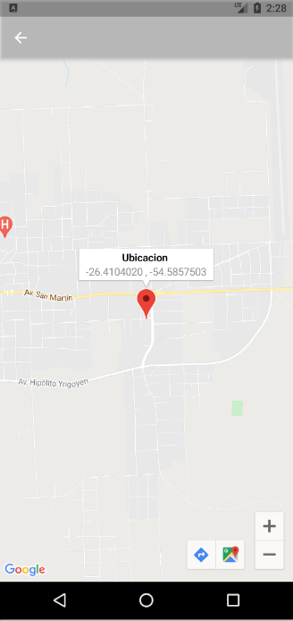

# fire_base_app

Ejemplo con firebase acceso email: test@test.com clave: 123456. Realiza las validaciones en el stream, guarda en firebase y posee un mapa donde se puede seleccionar la ubicacion(para seleccionar una ubicacion seleccionar un punto del mapa y se agregara un marker al seleccionar el marker aparecera la latitud y longitud de la ubicacion si se hace click se cierra la ventana y devuelve la ubicacion seleccionada) 

## Diseño de ventanas

